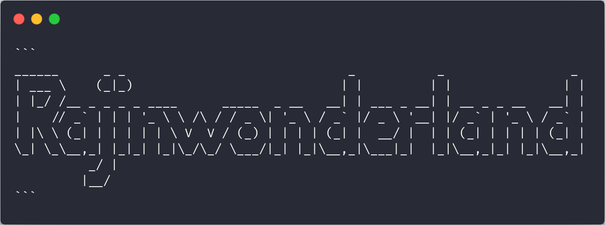

<p align="center"></p>
<h1 align="center">Welcome to <code>react-code-blocks</code> 👋👋👋</h1>
<p>
  <a href="https://www.npmjs.com/package/react-code-blocks" target="_blank">
    
  </a>
   <a href="https://www.npmjs.com/package/react-code-blocks" target="_blank">
  
  </a>
  
  <a href="https://react-code-blocks.rajinwonderland.vercel.app" target="_blank">
    
  </a>
  <a href="#" target="_blank">
    
  </a>
  <a href="https://twitter.com/rajinwonderland" target="_blank">
    
  </a>
</p>

> React components for rendering code snippets with syntax highlighting

> **BREAKING CHANGES**: `VERSION >= 0.0.8-alpha` now requires a nodejs version >= 12

- [Background](#background)
  - [✨ Demo](#-demo)
- [Install](#install)
- [Usage](#usage)
- [Components](#components)
  - [CodeBlock](#codeblock)
    - [Props](#props)
  - [CopyBlock](#copyblock)
    - [Props](#props-1)
- [Supported Themes](#supported-themes)
- [Supported Languages](#supported-languages)
- [Alternatives](#alternatives)
- [Todos](#todos)
- [Show your support](#show-your-support)
- [Author](#author)
- [Maintainer](#maintainer)
- [Contributors ✨](#contributors-)

## Background

Initially, this started as a small project looking to modify [Atlaskit's]() Code Block component to support more languages (i.e `graphql`, `reasonml`, etc). It then rapidly evolved into a **never-ending rabbithole** which ended up with support for themes (i.e railscast, darcula, monokai, etc), customizable styles, and copy functionality too!

I don't plan on keeping this updated unless people are looking to actually use it. So don't be shy! Feel free to post an [issue](https://help.github.com/en/github/managing-your-work-on-github/creating-an-issue) or a [pr](https://help.github.com/en/github/collaborating-with-issues-and-pull-requests/creating-a-pull-request).

### ✨ [Demo](https://react-code-blocks.netlify.com/)

[](https://app.netlify.com/sites/react-code-blocks/deploys)

[](https://codesandbox.io/s/react-code-blocks-xgjrr?fontsize=14)

## Install

Install `react-code-blocks` via `yarn` or `npm`

```sh
yarn add react-code-blocks
```

```sh
npm i react-code-blocks
```

## Usage

> Updated usage instructions can be found [here](https://react-code-blocks.rajinwonderland.vercel.app/)

```js
import { CopyBlock } from 'react-code-blocks';
```

```js
function MyCodeComponent(props) {
  return (
    <CopyBlock
      text={props.code}
      language={props.language}
      showLineNumbers={props.showLineNumbers}
      wrapLines
    />
  );
}
```

## Components

### CodeBlock

A simple code block component

```js
import { CodeBlock, dracula } from 'react-code-blocks';

function MyCoolCodeBlock({ code, language, showLineNumbers }) {
  return (
    <CodeBlock
      text={code}
      language={language}
      showLineNumbers={showLineNumbers}
      theme={dracula}
    />
  );
}
```

#### Props

> Note that `CodeBlock` & `CopyBlock` share exactly the same props

| name              | type      | default      | description                                                                                                                                                    |
| ----------------- | --------- | ------------ | -------------------------------------------------------------------------------------------------------------------------------------------------------------- |
| `text`            | `string`  | **required** | The code to be formatted                                                                                                                                       |
| `language`        | `string`  | "text"       | The language in which the code is written. [See here](LANGUAGES.md) for a list of supported languages                                                          |
| `showLineNumbers` | `boolean` | `true`       | Indicates whether or not to show line numbers                                                                                                                  |
| `theme`           | `object`  | **dracula**  | A theme object for the code block. [See here](THEMES.md) for a list of supported themes                                                                        |  |
| `highlight`       | `string`  | ""           | Lines to highlight! For multiple lines, use a comma i.e `highlight="1,6,7"`. For a range of lines, use a `-` i.e `highlight="1-5"` for highlighting lines 1-5. |

---

> **more to come...**

### CopyBlock

A code block component with a little copy button for copying a snippet.

```jsx
import { CopyBlock, dracula } from 'react-code-blocks';

function MyCoolCodeBlock({ code, language, showLineNumbers }) {
  <CopyBlock
    text={code}
    language={language}
    showLineNumbers={showLineNumbers}
    theme={dracula}
    codeBlock
  />;
}
```

#### Props

Same as the `CodeBlock`'s component with the exception of one!

| name        | type       | default | description                                                                                                                       |
| ----------- | ---------- | ------- | --------------------------------------------------------------------------------------------------------------------------------- |
| `codeBlock` | `boolean`  | `false` | Indicates whether to render the `CopyBlock` as an inline `Code` component or a `CodeBlock` component                              |
| `onCopy`    | `function` | -       | The onCopy function is called if the copy icon is clicked. This enables you to add a custom message that the code block is copied |

## Supported Themes

For a list of supported themes, check out the [list here](THEMES.md)

## Supported Languages

For a list of supported languages, check out the [list here](LANGUAGES.md)

## Alternatives

If you're looking for some more maintained solutions, I'd suggest the following:

- [`react-syntax-highlighter`](https://github.com/conorhastings/react-syntax-highlighter): syntax highlighting component for react with `prismjs` or `highlightjs` `ast` using inline styles by @conorhastings.
  - It's actually used in this project as well! :smile:
- [`react-highlight.js`](https://github.com/bvaughn/react-highlight.js): A lightweight React wrapper around the `Highlight.js` syntax highlighting library by @bvaughn.
- [`react-live`](https://github.com/FormidableLabs/react-live): A flexible playground for live editing React components by @FormidableLabs.
- [`@atlaskit/code`](https://atlaskit.atlassian.com/docs/getting-started): Renders inline code snippets and code blocks
  - Original inspiration for this project kit for this project
- [`carbon-components-react`](http://react.carbondesignsystem.com/?path=/story/codesnippet--inline): Check out their `<CodeSnippet>` component which supports multi-line, single-line, and inline snippets along with added copying functionality.

> Feel free to add any other alternative packages here! :smile:

## Todos

- [x] Add a better readme
- [x] Highlighting line feature
- [x] Supported Themes documentation
- [x] Supported Languages documentation
- [x] Add a License
- [ ] Docs for usage with GatsbyJS
- [ ] Docs for usage with `MDX`
- [ ] Contributor guide for development
- [ ] Contributor guide for adding themes
- [ ] Contributor guide for adding languages
- [ ] Document props for `Code` component
- [ ] Better demo
- [x] Storybook with Docs
- [x] Move to typescript
- [ ] A component with a terminal around it. because why not!? 🧐

## Show your support

Give a ⭐️ if this project helped you!

---

_This README was generated with ❤️ by [readme-md-generator](https://github.com/kefranabg/readme-md-generator)_

## Author

<!-- <div style="display:grid;"> -->
<!--  -->

<!-- </div> -->

- Website: [AreaHub](https://areahub.com)
- Twitter: [@rajinwonderland](https://twitter.com/rajinwonderland)
- Github: [@rajinwonderland](https://github.com/rajinwonderland)

## Maintainer

react-code-blocks is currently maintained by [Thomas](https://github.com/thomasmost)

- Website: [Bend](https://usebend.com/)
- Bluesky: [@thomasmost.bsky.social](https://bsky.app/profile/thomasmost.bsky.social)
- Github: [@thomasmost](https://github.com/thomasmost)

## Contributors ✨

Thanks goes to these wonderful people ([emoji key](https://allcontributors.org/docs/en/emoji-key)):

<!-- ALL-CONTRIBUTORS-LIST:START - Do not remove or modify this section -->
<!-- prettier-ignore-start -->
<!-- markdownlint-disable -->
<table>
  <tr>
    <td align="center"><a href="http://hishri.com"><br /><sub><b>Taha HICHRI</b></sub></a><br /><a href="https://github.com/rajinwonderland/react-code-blocks/commits?author=tahaHichri" title="Code">💻</a></td>
    <td align="center"><a href="https://github.com/florpor"><br /><sub><b>florpor</b></sub></a><br /><a href="https://github.com/rajinwonderland/react-code-blocks/issues?q=author%3Aflorpor" title="Bug reports">🐛</a></td>
    <td align="center"><a href="https://github.com/HamadTheIronside"><br /><sub><b>Abdollah Keshtkar</b></sub></a><br /><a href="#example-HamadTheIronside" title="Examples">💡</a> <a href="https://github.com/rajinwonderland/react-code-blocks/commits?author=HamadTheIronside" title="Documentation">📖</a> <a href="https://github.com/rajinwonderland/react-code-blocks/commits?author=HamadTheIronside" title="Code">💻</a></td>
    <td align="center"><a href="https://lukasbals.com"><br /><sub><b>Lukas Bals</b></sub></a><br /><a href="https://github.com/rajinwonderland/react-code-blocks/commits?author=lukasbals" title="Code">💻</a></td>
    <td align="center"><a href="https://bofeiwang.com"><br /><sub><b>Bobby Wang</b></sub></a><br /><a href="https://github.com/rajinwonderland/react-code-blocks/commits?author=bofeiw" title="Code">💻</a></td>
    <td align="center"><a href="http://www.mpeveler.com"><br /><sub><b>Matthew Peveler</b></sub></a><br /><a href="https://github.com/rajinwonderland/react-code-blocks/commits?author=MasterOdin" title="Documentation">📖</a></td>
    <td align="center"><a href="https://github.com/daceynolan"><br /><sub><b>Dacey Nolan</b></sub></a><br /><a href="#example-daceynolan" title="Examples">💡</a> <a href="https://github.com/rajinwonderland/react-code-blocks/commits?author=daceynolan" title="Documentation">📖</a> <a href="https://github.com/rajinwonderland/react-code-blocks/commits?author=daceynolan" title="Code">💻</a></td>
  </tr>
  <tr>
    <td align="center"><a href="https://github.com/kevineaton603"><br /><sub><b>Kevin Eaton</b></sub></a><br /><a href="https://github.com/rajinwonderland/react-code-blocks/commits?author=kevineaton603" title="Code">💻</a></td>
  </tr>
</table>

<!-- markdownlint-restore -->
<!-- prettier-ignore-end -->

<!-- ALL-CONTRIBUTORS-LIST:END -->

This project follows the [all-contributors](https://github.com/all-contributors/all-contributors) specification. Contributions of any kind welcome!
